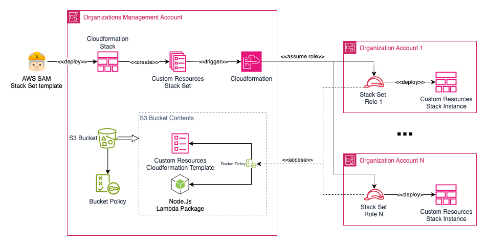
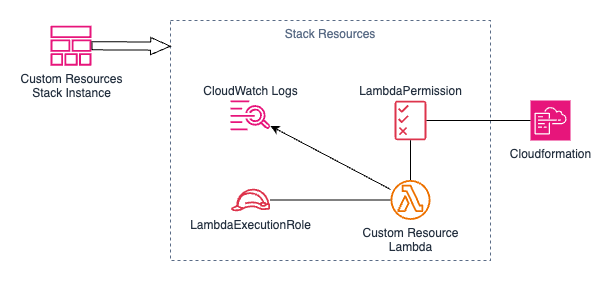

<!-- markdownlint-disable MD033 -->
# TruStep Custom Resources for Cloudformation

## Installation Instructions

You can install the custom resources using one of the following methods:

- <a href="#aws-sam-method">AWS SAM Method</a>
- <a href="#pure-cloudformation-method">Pure Cloudformation Method</a>
- <a href="#cloudformation-stack-set-method">Cloudformation Stack Set Method</a>

They are equivalent in terms of enabling the use of the cloudformation custom resources. But they where meant to be used in distinct situations.
If you will deploy the custom resources in a single account, either of the methods will work, but you probably will want to follow the AWS SAM Method, or the Pure Cloudformation method if you are not familiar with AWS SAM.
But if you need to deploy them on multiple accounts we suggest you use the Cloudformation Stack Set Method.

After successfull deployment, check if the corresponding cloudformation stack was deployed correctly to the desired account. You can do it either by console or with AWS CLI. You can start using the custom resources as you would with any other custom resource. The service token (actually the lambda arn) will be exported in the outputs of the stack so you can copy/paste it or reference it using cloudformation import value function.

### AWS SAM Method

The template is created using AWS SAM Cloudformation extension. You should follow this steps to install it:

1. install [AWS CLI](https://docs.aws.amazon.com/cli/latest/userguide/cli-chap-getting-started.html)
2. install [AWS SAM](https://docs.aws.amazon.com/serverless-application-model/latest/developerguide/serverless-getting-started.html)
3. clone this repository
4. configure credentials with appropriated permissions to deploy to the account. you can optionally run the sam pipeline bootstrap command to allow aws sam to create a stack containing the user and roles with appropriated permissions, or use a previous one created for other deployments in the account. Please refer to [AWS CLI](https://docs.aws.amazon.com/cli/latest/userguide/cli-chap-getting-started.html) and [AWS SAM](https://docs.aws.amazon.com/serverless-application-model/latest/developerguide/serverless-getting-started.html) documentation for further details.
5. Possibly adjust [samconfig.toml](samconfig.toml) file with the desired value for **QuicksightPermissionsLogGroupRetention**. The default is 5 days.
6. (Possibly) adjust the [io.trustep.aws.cloudformation.custom-resources.sam.yaml](io.trustep.aws.cloudformation.custom-resources.sam.yaml) template to better fit your needs.
7. run sam build, package and deploy using the with parameters appropriated to your environment, pointing to the samconfig.toml and sam template you customized in the previous steps. You will have to enable CAPABILITY_IAM capability. Please refer to [AWS SAM](https://docs.aws.amazon.com/serverless-application-model/latest/developerguide/serverless-getting-started.html) documentation for further details.
8. check if sam deployed the stack without errors. In case of any error, resolve the issue and redeploy. Remember that if its first time deploying the stack, you will need to remove the failed stack before retrying.

Please take notice that the only parameter you should provide is the retention period of the log group used by the lambda. The other methods you will be prompted to provide S3 bucket location details of the lambda package artifacts, things that AWS SAM framework will handle for you automatically with this method.

### Pure Cloudformation Method

This method you will use the template [io.trustep.aws.cloudformation.custom-resources.cfn.yaml](io.trustep.aws.cloudformation.custom-resources.cfn.yaml). You will need to provide values for the parameters presented in this table:

| Parameter Name                           | Mandatory | Default | Description |
| ---------------------------------------- | --------- | ------- | ----------- |
| QuicksightPermissionsLogGroupRetention   | Yes       | 5 days  | Retention in days for QuicksightPermissions Lambda Function Log Group |
| QuicksightPermissionsS3BucketCode        | Yes       | none    | Points to the S3 bucket name where cloudformation can find the lambda package |
| QuicksightPermissionsS3ObjectKeyCode     | Yes       | none    | Points to the S3 bucket key where cloudformation can find the lambda package |
| QuicksightPermissionsS3ObjectVersionCode | No        | none    | Points to the S3 object version where cloudformation can find the lambda package |

If you use the AWS Console, the parameters will be presented to you in the interface.
But if you will deploy using regular AWS CLI commands, you will probably want to create a json parameter file. A sample json parameter file is provided at [io.trustep.aws.cloudformation.custom-resources.cfn-parameters.json](io.trustep.aws.cloudformation.custom-resources.cfn-parameters.json).

You should follow this steps to install it using aws cli:

1. install [AWS CLI](https://docs.aws.amazon.com/cli/latest/userguide/cli-chap-getting-started.html)
2. clone this repository
3. configure credentials with appropriated permissions to deploy to the account. You can use any method supported by aws cli to do it. Check AWS CLI documentation for further details.
4. Obtain the deployment package for the lambda function. It can be downloaded from this github repository in the corresponding release section or you can build your own using the repository. Please check <a href="#pure-cloudformation-method">Building lambda package from the source</a> if you want to build your own package.
5. Copy the build package into a S3 bucket accesible to the principal you will be using to deploy the cloudformation stack. The S3 bucket will have to be created previously to executing this steps.
6. Create a template parameter file and adjust the values of each parameter to suite your environment. The three S3 parameters refers to the file you just copyed in the previous step.
7. Run the `aws cloudformation create-stack` command pointing to the template at [io.trustep.aws.cloudformation.custom-resources.cfn.yaml](io.trustep.aws.cloudformation.custom-resources.cfn.yaml). Point the parameter to the file you created at previous steps. Remember to prefix those with file:// to use local filesystem. Or use any other source supported by the aws cli. You will have to enable CAPABILITY_IAM capability. Please run `aws cloudformation create-stack help` for further details.

### Cloudformation Stack Set Method

This method you will use the template [io.trustep.aws.cloudformation.custom-resources.cfn.yaml](io.trustep.aws.cloudformation.custom-resources.cfn.yaml) aswell. But you will need to create a stack set using the method is best suited to your environment. It will mentioned only the key aspects of configuring and embedding the pure cloudformation template within your stack set. A sample cloudformation template that creates the stack set is available at [io.trustep.aws.cloudformation.custom-resources.stack-set-example.cfn.yaml](io.trustep.aws.cloudformation.custom-resources.stack-set-example.cfn.yaml). Nevertheless, you will need to make some adjustments to it and check if the options are suited to your environment.

> [!IMPORTANT]
> If you are not familiar with Cloudformation Stack Set Concepts, please take a look at the [official AWS Documentation](https://docs.aws.amazon.com/AWSCloudFormation/latest/UserGuide/stacksets-concepts.html).

The stack set method assumes you have an administrative account that manages your AWS Organization. It assumes aswell you have one or more organization accounts where you want make available the custom resources.

First thing you have to keep in mind is that cloudformation deploys each stack instance within each corresponding account using the permissions of the assumed role within each account. The custom ressources template will point to the lambda package created by the <a href="#building-lambda-package-from-the-source">build process</a> and the role assumed by cloudformation should have access to the corresponding S3 object. Then, after the S3 bucket being created, you can <a href="#building-lambda-package-from-the-source">build</a> the lambda packages, customize the template parameters of your stack instance and copy both zip and template files to the bucket.

There are many forms to setup the bucket and the role permissions. You can choose whatever architecture best fit for your needs, but it will be assumed you previously created an S3 bucket within the administrative account and will setup cross account access to this bucket for each role assumed by cloudformation stack set deployment process. This way you will have a centralized artifact repository from where all the stack instances looks up their artifacts. The figure shows the architecture proposed:



We suggest you create a private S3 bucket (a bucket without any kind of public access) and setup bucket policy to allow the cross account access. Here is a commented sample bucket policy you can use as a model for your own environment. Please remove comments if you copy/paste the policy.

```json
{
    "Version": "2012-10-17",
    "Statement": [
        {
            "Sid": "ObjectLevel-ReadOnly",
            "Effect": "Allow",
            "Principal": "*", #access to all principals
            "Action": "s3:GetObject",
            "Resource": "arn:aws:s3:::<my-bucket-name>/*",
            "Condition": { # but only to principals within your organization. You can narrow access if you want.
                "StringEquals": {
                    "aws:PrincipalOrgID": "<my-organization-id>" #you can setup access for entire organization account level this way.
                }
            }
        },
        {
            "Sid": "BuckeLevel-ReadOnly",
            "Effect": "Allow",
            "Principal": "*", #access to all principals
            "Action": "s3:ListBucket",
            "Resource": "arn:aws:s3:::<my-bucket-name>",
            "Condition": { # but only to principals within your organization. You can narrow access if you want.
                "StringEquals": {
                    "aws:PrincipalOrgID": "<my-organization-id>" #you can setup access for entire organization account level this way.
                }
            }
        },
        {
            "Sid": "ObjectLevel-ReadWrite",
            "Effect": "Allow",
            "Principal": { # someone may have access to upload artifacts. You can setup whatever principal you see fit for your environment.
                "AWS": "arn-for-my-iam-principal"
            },
            "Action": "s3:PutObject*",
            "Resource": "arn:aws:s3:::<my-bucket-name>/*",
            "Condition": {
                "StringEquals": {
                    "aws:PrincipalOrgID": "<my-organization-id>" #you can setup access for entire organization account level this way.
                }
            }
        },
        {
            "Sid": "BuckeLevel-ReadWrite",
            "Effect": "Allow",
            "Principal": { # someone may have access to upload artifacts. You can setup whatever principal you see fit for your environment.
                "AWS": "arn-for-my-iam-principal"
            },
            "Action": "s3:ListBucket",
            "Resource": "arn:aws:s3:::<my-bucket-name>",
            "Condition": { # the principals you setup ealier should be within your organization. You can narrow access if you want.
                "StringEquals": {
                    "aws:PrincipalOrgID": "<my-organization-id>" #you can setup access for entire organization account level this way.
                }
            }
        }
    ]
}
```

If you setup the S3 bucket properly, you now have to create is a Stack Set. We choose to create it using a [AWS SAM](https://docs.aws.amazon.com/serverless-application-model/latest/developerguide/serverless-getting-started.html) template. The SAM deployment process ends up creating a regular cloudformatiom stack based on the SAM template. In the architecture depicted above, you can see the Cloudformation Stack creating the stack set, plus the S3 bucket that will be used to store and share the artifacts to be used when the cloudformation creates the stack instances in each account. It also shows the appropiated bucket policy that will allow the cross account access from each organization account to the S3 bucket artifacts. But you can use a regular cloudformation template. Or even create the stack set manually.

There are many forms to define your stack set. An example can be seen [here](io.trustep.aws.cloudformation.custom-resources.stack-set-example.cfn.yaml) to illustrate the concept. You can base your deployment in this example, or you can adapt it to suite your specific needs. 

> [!IMPORTANT]
> Consider that in the moment the stack set creates the stack instances, the artifacts should already be available to cloudformation, or else the stack instance creation will fail. You should copy the artifacts to the bucket and before deploying the stack set. You will have to enable CAPABILITY_IAM capability within the stack set you create.

The final result should looks similar to the architecture depicted above.

### Building lambda package from the source

It is supposed you will be using a shell environment compatible with bash to this build process. Please make adjustments to your environment if needed. You will need to install Node 20. You will also need npm, which comes preinstalled with node. If not, please install npm or use any other package management tool that supports package.json npm format.

1. Navigate to the `lambda/quicksight-permissions` folder
2. Run `npm install`
3. Run `npm run zip-build`
4. The package suited to be deployed as a lambda package will be created at dist folder.
5. Now copy the zip file to the S3 bucket as instructed by your choosen installation method.

### Elements created by the TruStep Custom Resources Stack

The following diagram depicts all elements the TruStep custom resources stack will deploys to your AWS Account:



After deploying this stack you can point your cloudformation templates to the lambda arn exported by the stack.
